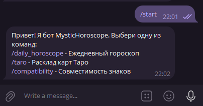
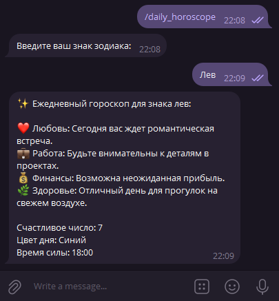
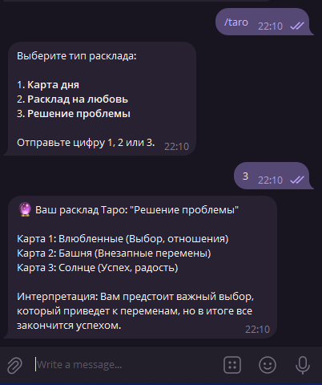
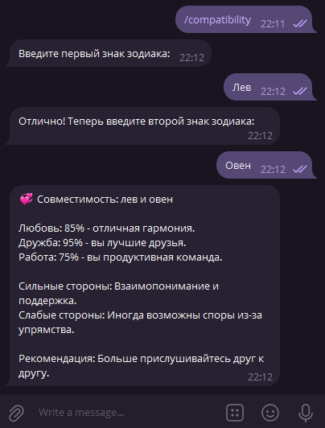

# MysticHoroscope Бот

Этот телеграм-бот предназначен для генерации гороскопов и предсказаний.

## Описание

Бот предоставляет следующие функции:
- `/start` - запуск бота, получение команд
- `/daily_horoscope` - ежедневный гороскоп по знаку зодиака.
- `/taro` - виртуальный расклад карт Таро.
- `/compatibility` - анализ совместимости двух знаков зодиака.

## Инструкция по запуску

1.  **Клонируйте репозиторий:**
    ```bash
    git clone <repo-link>
    ```

2.  **Установите зависимости:**
    ```bash
    npm install
    ```

3.  **Настройте переменные окружения:**
    - Создайте файл `.env` в корне проекта, скопировав `.env.example`.
    - Вставьте ваш токен для телеграм-бота в файл `.env`:
      ```
      TELEGRAM_BOT_TOKEN=ВАШ_ТОКЕН_ЗДЕСЬ
      ```

4.  **Запустите бота:**
    ```bash
    npm start
    ```

## Примеры работы

**Запуск бота**
/start 


**Получение ежедневного гороскопа:**
/daily_horoscope 


**Расклад Таро:**
/taro


**Совместимость знаков**
/compatibility
