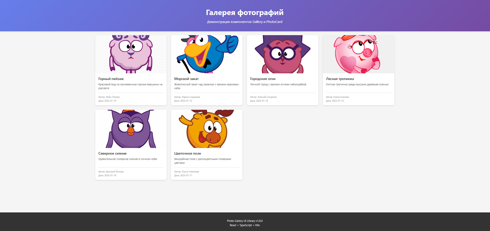
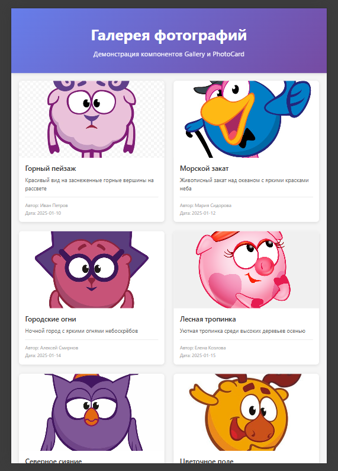

# Photo Hosting - Photo Gallery Application

## Быстрый старт

### Установка зависимостей

```bash
# Установить зависимости библиотеки
cd ui
npm install

# Установить зависимости демо-приложения
cd ../frontend
npm install
```

### Сборка библиотеки

```bash
cd ui
npm run build
```

### Запуск демо-приложения

```bash
cd frontend
npm run dev
```

## Компоненты

### PhotoCard

Карточка фотографии с метаданными.

**Props:**
- `title: string` - название фотографии
- `description: string` - описание
- `author: string` - автор
- `uploadDate: string` - дата загрузки
- `imageUrl?: string` - URL изображения (опционально)
- `className?: string` - дополнительный CSS класс

### Gallery

Адаптивная сетка для отображения фотокарточек.

**Props:**
- `children: React.ReactNode` - дочерние элементы (PhotoCard)
- `className?: string` - дополнительный CSS класс

**Адаптивность:**
- Мобильные (< 640px): 1 колонка
- Планшеты (640px - 1024px): 2 колонки
- Десктопы (1024px - 1440px): 3 колонки
- Большие экраны (> 1440px): 4 колонки

## 🛠️ Скрипты разработки

### Библиотека (ui)

```bash
npm run dev          # Режим разработки с watch
npm run build        # Сборка библиотеки
npm run lint         # Проверка ESLint
npm run lint:fix     # Автоисправление ESLint
npm run test         # Запуск тестов
npm run test:coverage # Запуск тестов с покрытием
```

### Демо-приложение (frontend)

```bash
npm run dev          # Запуск dev-сервера
npm run build        # Сборка приложения
npm run preview      # Предпросмотр prod-сборки
npm run lint         # Проверка ESLint
npm run lint:fix     # Автоисправление ESLint
npm run test         # Запуск тестов
npm run test:coverage # Запуск тестов с покрытием
```

## 📸 Скриншоты

### Десктоп версия

Галерея на больших экранах отображается в 3-4 колонки для удобного просмотра.



### Планшет

На планшетах галерея адаптируется до 2 колонок.



### Мобильные устройства

На мобильных устройствах галерея отображается в одну колонку.

